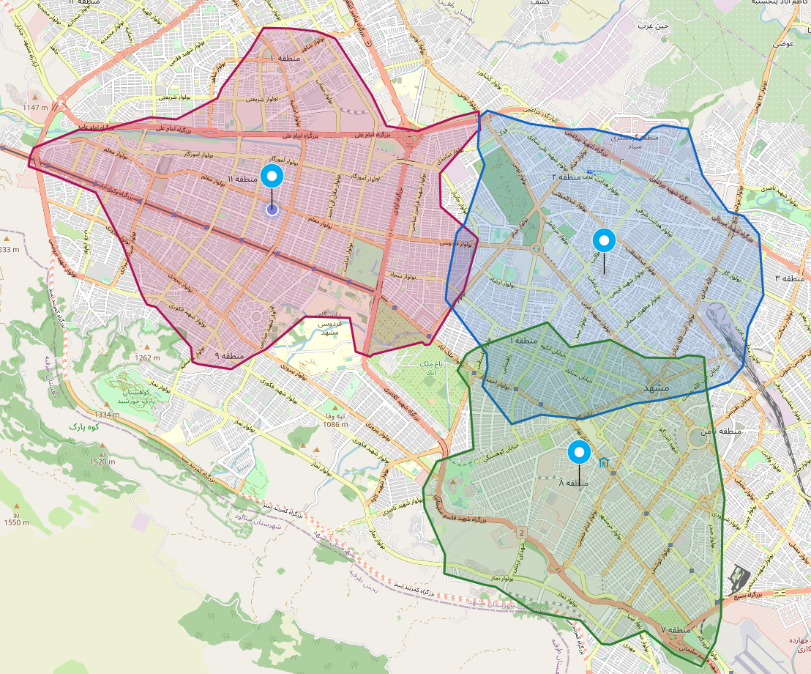
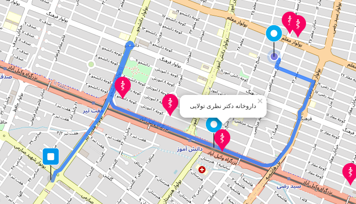

# **Map of Accessibility and Navigations**

## 💡 **Motivation**

Today, with the development of technology and computer science, a new topic has emerged called smart cities, the primary purpose of which is to expand urban facilities for the general public and create an optimally distribute these resources throughout the city. Technologies such as the Internet of Things, artificial intelligence, as well as satellite systems provide researchers and engineers with many opportunities to use these facilities to create tools that help city managers achieve the goal of creating a smart city. In this project, we have developed a web-based tool that can be used to allocate and distribute resources in the city using online map systems. Calculating and plotting the polygon of the accessibility points, which are scientifically being called Isochrones, will show the areas covered in terms of time and distance from one or more specific points on the map. Also, by examining the accessible routes, we show how, having several points in the city, you can cross them consecutively to reach a destination point. Using these facilities makes it possible to decide on the construction of urban facilities and routes with more information about the current situation of the places.

 

## **Project Overview**
This project is consisted of three main features to prepare the needed tool for the purpose explained above. 

1. Isochrones
2. Navigation
3. POI
   
 

## Isochrones
Isochrone maps, also known as travel time maps, are maps that show all reachable locations within a specified limit by a specified mode of transport. They are most used to depict travel times, such as drawing a 30-minute travel time perimeter around a start location, and 1 km travel distance around the start location.

Isochrone part of the program is a tool that shows the covered area around a specific point or location. For example, the areas around a particular hospital in the center of the Newyork city could be accessed within 30 minutes. One of the purposes of the isochrone in this application is to show all the areas under cover of a specific time/distance from an objective, such as hospitals or green areas. We can have these Isochrones for multiple objectives. All the areas that are not accessible to such facilities within the specified time/distance can be recognized by analyzing the coverage of Isochrones. The figure 1 indicates this purpose.

<b>Figure 1 -</b> Multiple Isochrones showing the covered areas.

 

## Navigation
Today navigation systems are very popular in so many cases. This project utilizes it to recognize the current paths through multiple points and show the possibility of optimizing them.

<b>Figure 2 -</b> Multi point navigation + POI

## POI (Points of Interest)
POI is a term used in cartography (and therefore in reference to maps or geodatasets) for the choice to represent a particular feature using an icon that occupies a particular point, such as hostpitals, restaurants, parks and etc.

<b>Figure 3 -</b> POI

## **Demo**
The gifs below shows the explained components of the app.

 

<b>Figure 4 -</b> Isochrone demo

 

<b>Figure 5 -</b> Multi-point Navigation demo

# How it works?

This project was bootstrapped with [Create React App](https://github.com/facebook/create-react-app).

## Available Scripts

In the project directory, you can run:

### `npm start`

Runs the app in the development mode.\
Open [http://localhost:3000](http://localhost:3000) to view it in the browser.

The page will reload if you make edits.\
You will also see any lint errors in the console.

### `npm test`

Launches the test runner in the interactive watch mode.\
See the section about [running tests](https://facebook.github.io/create-react-app/docs/running-tests) for more information.

### `npm run build`

Builds the app for production to the `build` folder.\
It correctly bundles React in production mode and optimizes the build for the best performance.

The build is minified and the filenames include the hashes.\
Your app is ready to be deployed!

See the section about [deployment](https://facebook.github.io/create-react-app/docs/deployment) for more information.

### `npm run eject`

**Note: this is a one-way operation. Once you `eject`, you can’t go back!**

If you aren’t satisfied with the build tool and configuration choices, you can `eject` at any time. This command will remove the single build dependency from your project.

Instead, it will copy all the configuration files and the transitive dependencies (webpack, Babel, ESLint, etc) right into your project so you have full control over them. All of the commands except `eject` will still work, but they will point to the copied scripts so you can tweak them. At this point you’re on your own.

You don’t have to ever use `eject`. The curated feature set is suitable for small and middle deployments, and you shouldn’t feel obligated to use this feature. However we understand that this tool wouldn’t be useful if you couldn’t customize it when you are ready for it.

## Learn More

You can learn more in the [Create React App documentation](https://facebook.github.io/create-react-app/docs/getting-started).

To learn React, check out the [React documentation](https://reactjs.org/).

### Code Splitting

This section has moved here: [https://facebook.github.io/create-react-app/docs/code-splitting](https://facebook.github.io/create-react-app/docs/code-splitting)

### Analyzing the Bundle Size

This section has moved here: [https://facebook.github.io/create-react-app/docs/analyzing-the-bundle-size](https://facebook.github.io/create-react-app/docs/analyzing-the-bundle-size)

### Making a Progressive Web App

This section has moved here: [https://facebook.github.io/create-react-app/docs/making-a-progressive-web-app](https://facebook.github.io/create-react-app/docs/making-a-progressive-web-app)

### Advanced Configuration

This section has moved here: [https://facebook.github.io/create-react-app/docs/advanced-configuration](https://facebook.github.io/create-react-app/docs/advanced-configuration)

### Deployment

This section has moved here: [https://facebook.github.io/create-react-app/docs/deployment](https://facebook.github.io/create-react-app/docs/deployment)

### `npm run build` fails to minify

This section has moved here: [https://facebook.github.io/create-react-app/docs/troubleshooting#npm-run-build-fails-to-minify](https://facebook.github.io/create-react-app/docs/troubleshooting#npm-run-build-fails-to-minify)
